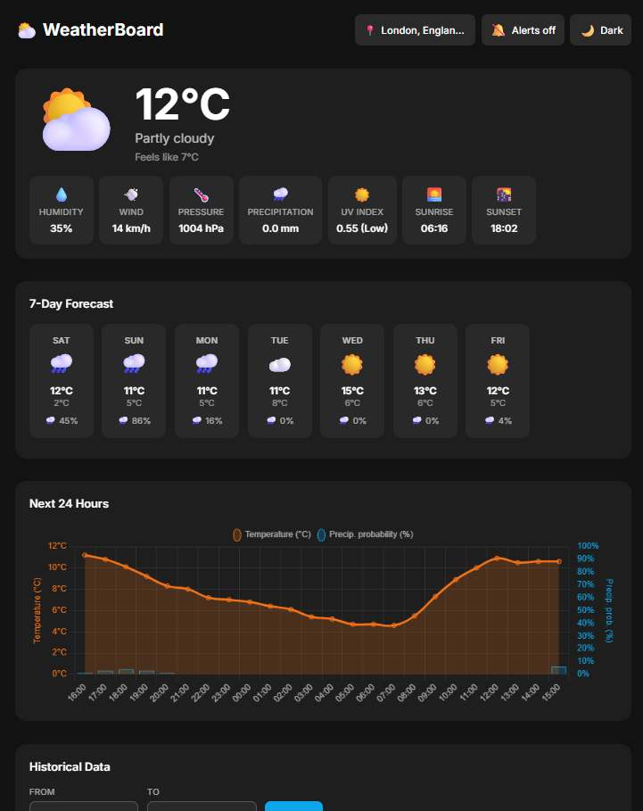

# WeatherBoard

> A Next.js 14 weather dashboard — built as a demo to showcase **pix3lboard** and the **pix3lmcp** MCP server.



---

## What this demo shows

This project was built entirely with [Claude Code](https://claude.ai/claude-code) using two custom MCP servers:

- **[pix3lboard](https://github.com/pix3l/pix3lboard)** — a Kanban board server used to track development tasks in real time. Every card was created automatically at the start of the session and moved from *Backlog → In Progress → Done* as the code was written.
- **pix3lmcp** — the MCP server that exposes pix3lboard's tools to Claude Code, allowing the AI to read and write the board without any manual interaction.

The result: a fully functional weather app and a live Kanban board, both generated and maintained by Claude Code in a single session.

---

## Features

- 🌤️ **Current weather** — temperature, feels-like, humidity, wind, pressure, UV index, sunrise/sunset
- 📅 **7-day forecast** with weather icons and precipitation probability
- 📈 **Hourly chart** — temperature + precipitation probability for the next 24 h (dual Y axis)
- 🗂️ **Historical charts** with date range picker:
  - Temperature (max/min with fill)
  - Atmospheric pressure
  - Precipitation
  - Humidity
  - Wind speed
- 🔀 **Variable overlay chart** — any two variables on dual Y axes + Pearson correlation
- 📆 **Year comparison chart** — same date range across two different years (1940 → present)
- 🔍 **City search** — geocoding powered by Open-Meteo
- 🌙 **Dark / Light / System theme** with localStorage persistence
- 📲 **PWA** — installable, works offline with last cached data
- 🔔 **Web Push notifications** for rain/storm alerts

---

## Data source

All weather data comes from [Open-Meteo](https://open-meteo.com/) — free, no API key required.
API calls are proxied through Next.js API routes with appropriate `Cache-Control` headers.

---

## Quick start

1. Clone the repository:
   ```bash
   git clone https://github.com/YOUR_USERNAME/pix3lweather.git
   cd pix3lweather
   ```

2. Copy the example env file and fill in the values:
   ```bash
   cp .env.local.example .env.local
   ```

3. Install dependencies:
   ```bash
   npm install
   ```

4. Run the dev server:
   ```bash
   npm run dev
   ```

5. Open [http://localhost:3000](http://localhost:3000)

---

## Deploy on Vercel

[](https://vercel.com/new/clone?repository-url=https://github.com/YOUR_USERNAME/pix3lweather)

---

## Environment variables

| Variable | Description | Required | Example |
|---|---|---|---|
| `NEXT_PUBLIC_DEFAULT_CITY` | Display name for the default location | Yes | `Milan` |
| `NEXT_PUBLIC_DEFAULT_LAT` | Latitude of the default location | Yes | `45.4654` |
| `NEXT_PUBLIC_DEFAULT_LON` | Longitude of the default location | Yes | `9.1859` |
| `NEXT_PUBLIC_VAPID_PUBLIC_KEY` | VAPID public key for push notifications | No | `BxxxxxxX...` |
| `VAPID_PRIVATE_KEY` | VAPID private key for push notifications | No | `xxxxxxx...` |

### Generating VAPID keys

```bash
npx web-push generate-vapid-keys
```

> **Note:** Push subscriptions are stored in memory. For production, replace the in-memory store in `lib/push.ts` with a database.

---

## Tech stack

| Layer | Tool |
|---|---|
| Framework | Next.js 14 (App Router) |
| Styling | Tailwind CSS |
| Charts | Chart.js + react-chartjs-2 |
| Themes | next-themes |
| PWA | next-pwa |
| Push | web-push (VAPID) |
| Data | Open-Meteo API |

---

## License

MIT
